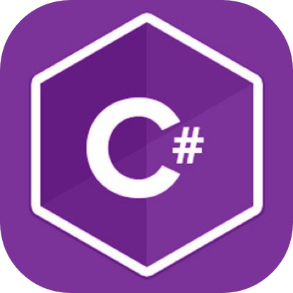
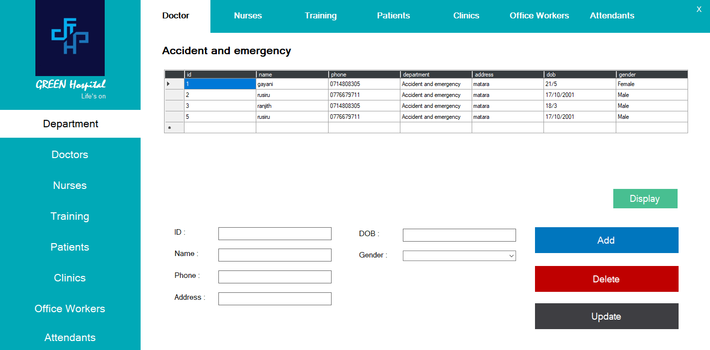
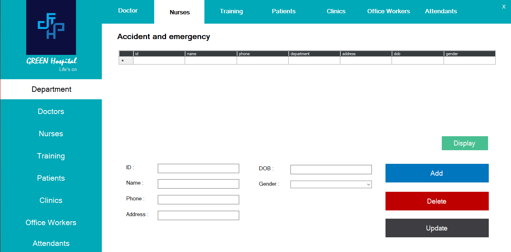
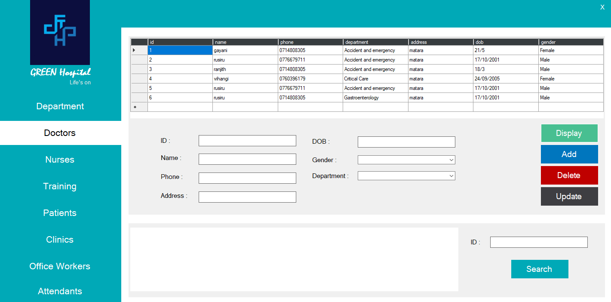
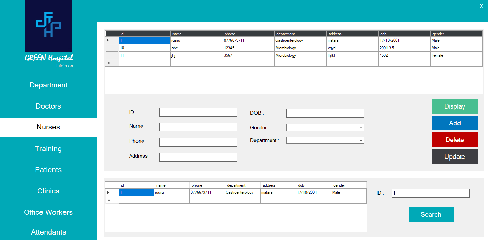
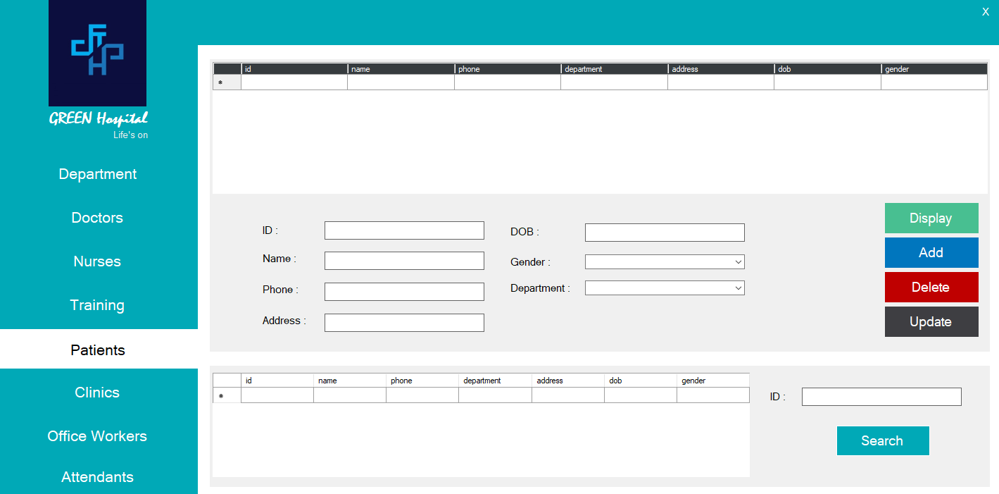

<h2 align="left">Hospital-management-desktop-application</h2> 
<h2 align="left">Hospital-management-desktop-application</h2> 

<h4 align="left">LANGUAGES AND TOOLS</h4>

 

 

This is a Hospital Management Desktop Application built using C#, .NET Framework, and SQL Server as part of the PUSL2021 - Computing Group Project module coursework.  
The system is designed to streamline hospital administration by allowing secure management of patients, doctors, nurses, staff, departments, and clinics within a user-friendly interface.

<h4 align="left">Key Features </h4>

<h5 align="left">Hospital Administration Features</h5>
<ul align="left">
  <li>Manage Departments with color-coded priority indicators.</li>
  <li>Add, edit, delete, and search records for Doctors, Nurses, Patients, Office Workers, and Attendants.</li>
  <li>Training management module for scheduling and evaluating staff training.</li>
  <li>Clinic management module with services, schedules, and staff assignments.</li>
  <li>Advanced search by unique ID numbers for quick information retrieval.</li>
</ul>

<h5 align="left">System Features</h5>
<ul align="left">
  <li>User-friendly interface with intuitive navigation.</li>
  <li>CRUD operations (Create, Read, Update, Delete) across all modules.</li>
  <li>Real-time data updates and efficient database management.</li>
  <li>Scalable architecture with strong performance optimization.</li>
</ul>

<h5 align="left">Future Enhancements</h5>
<ul align="left">
  <li>Advanced analytics and reporting dashboards.</li>
  <li>Enhanced workflow automation for billing, scheduling, and notifications.</li>
  <li>Integration with other hospital IT systems and patient portals.</li>
</ul>

 

This project demonstrates full-stack desktop development skills, including user authentication, database design, CRUD operations, system architecture, and performance optimization.  
It provides a scalable, secure, and efficient hospital management solution for real-world healthcare environments.

 

 
 
 
 
 
